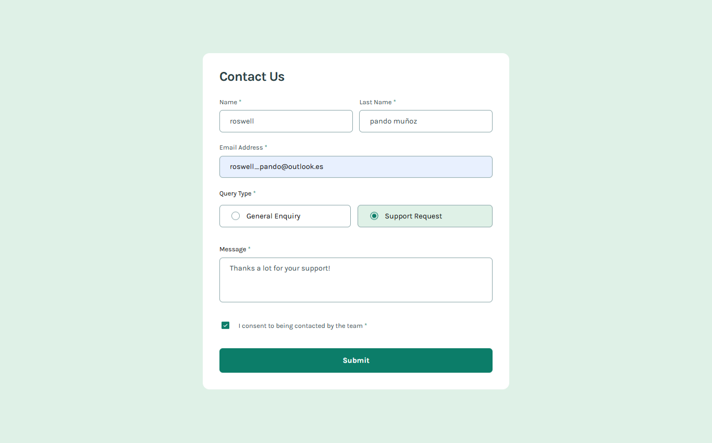

# Frontend Mentor - Contact form

This is a solution to the [Contact Form](https://www.frontendmentor.io/challenges/contact-form--G-hYlqKJj). Frontend Mentor challenges help you improve your coding skills by building realistic projects.

## Welcome! 👋

Thanks for checking out this front-end coding challenge.

[Frontend Mentor](https://www.frontendmentor.io) challenges help you improve your coding skills by building realistic projects.

**To do this challenge, you need a good understanding of HTML, CSS and JavaScript.**

## Table of contents

- [Overview](#overview)
  - [The challenge](#the-challenge)
  - [Screenshot](#screenshot)
  - [Links](#links)
- [My process](#my-process)
  - [Built with](#built-with)
  - [Useful resources](#useful-resources)
- [Author](#author)
- [Acknowledgments](#acknowledgments)

## Overview

### The challenge

Your challenge is to build out this contact form and get it looking as close to the design as possible. Pay particular attention to making this form accessible. Building accessible forms is a key skill for front-end developers. So this is a perfect challenge to practice.

You can use any tools you like to help you complete the challenge. So if you've got something you'd like to practice, feel free to give it a go.

Your users should be able to:

- Complete the form and see a success toast message upon successful submission
- Receive form validation messages if:
  - A required field has been missed
  - The email address is not formatted correctly
- Complete the form only using their keyboard
- Have inputs, error messages, and the success message announced on their screen reader
- View the optimal layout for the interface depending on their device's screen size
- See hover and focus states for all interactive elements on the page

Want some support on the challenge? [Join our community](https://www.frontendmentor.io/community) and ask questions in the **#help** channel.

### Screenshot

### Links

- Solution URL: [GitHub repository](https://github.com/welpmoz/faq-accordion).
- Live Site URL: [Live site](https://welpmoz.github.io/faq-accordion/)

## My process

### Built with

- Semantic HTML5 markup
- SASS
- Accessibility
- BEM methodology
- Git & GitHub
- Mobile first approach
- Typescript
- React
- React Hook Form
- Parcel
- Netlify

### Useful resources

- [Responsively](https://responsively.app/): A best browser for develop responsive webs.
- [animation rocks](https://cssanimation.rocks/): Provide several innovative ideas for animate your project.
- [Struturing SASS projects](https://www.youtube.com/watch?v=LVXUTvJnFYQ): An option for organize your sass projects.

## Author

- Github - [Roswell Jaime](https://github.com/welpmoz)
- Frontend Mentor - [@welpmoz](https://www.frontendmentor.io/profile/welpmoz)

## Acknowledgments

I greatly appreciate the work done by the Frontend Mentor team. Their challenges are diverse and well-suited for developers at all levels. Additionally, I'm grateful for the inclusion of Figma as a useful resource.